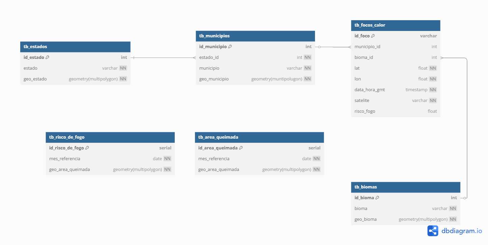
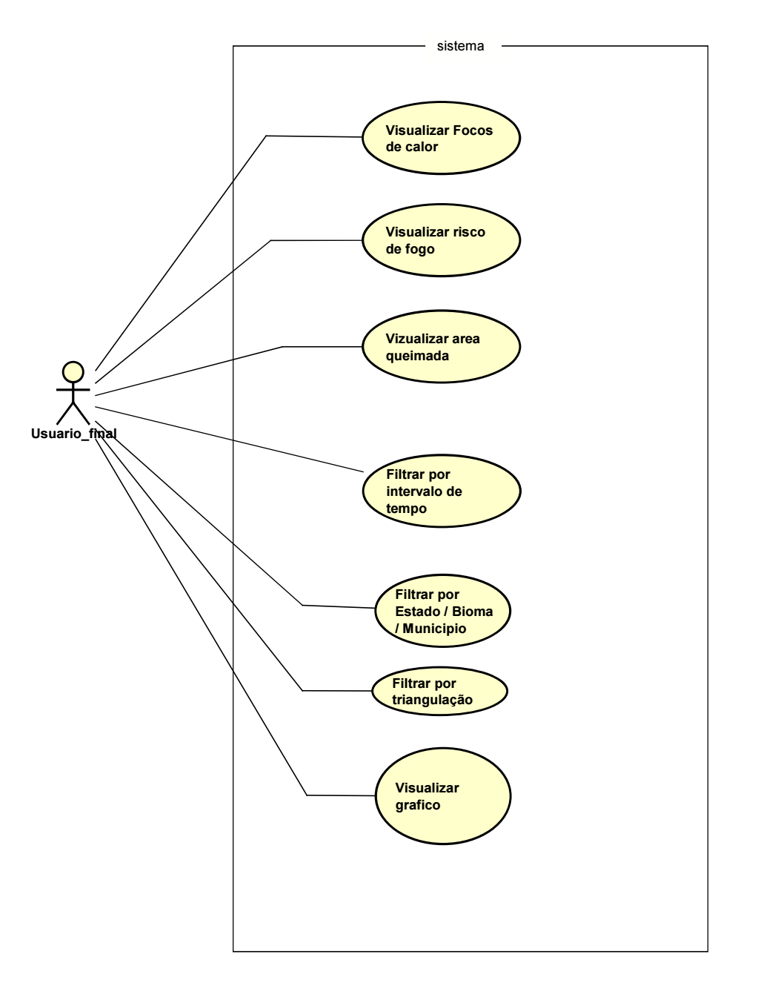
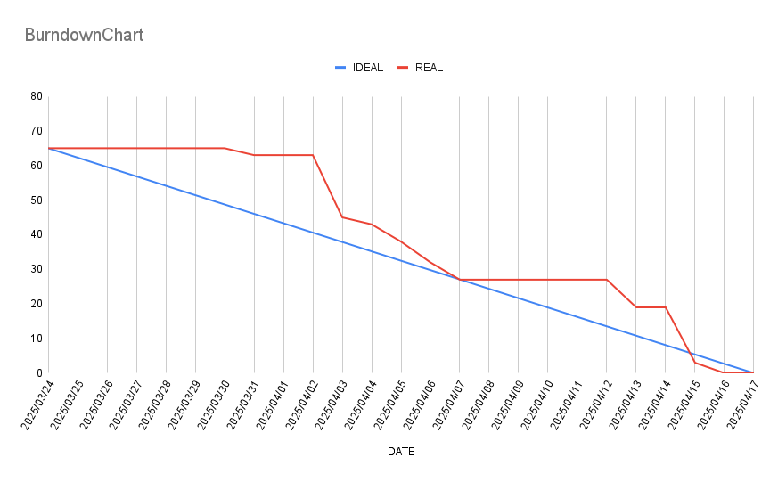
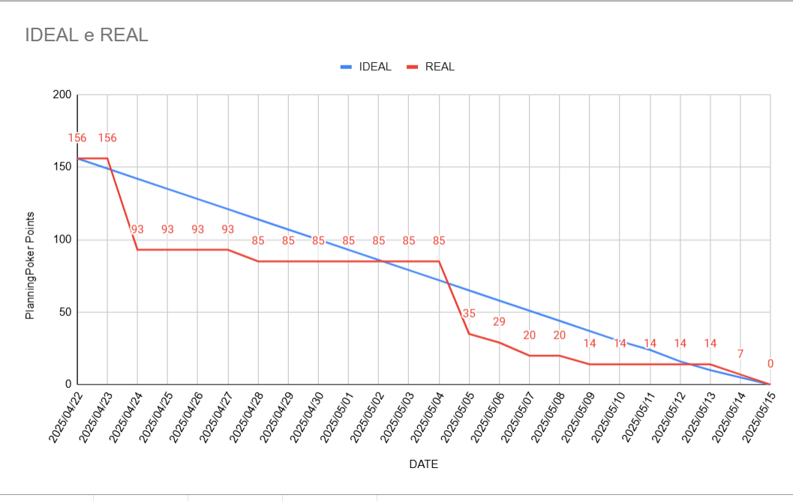

  <h1> Boitatá   HeatSentinel </h1>

  
  
  
  
  
  

---

## Sobre o Projeto

O **Boitatá - HeatSentinel** é uma aplicação web desenvolvida para exibir informações sobre **áreas queimadas**, **focos de calor** e **risco de fogo** no Brasil. Inspirado no **Programa Queimadas** do INPE, o projeto visa fornecer uma ferramenta acessível e interativa para a gestão ambiental e a formulação de políticas públicas.

O sistema utiliza dados geoespaciais para gerar visualizações detalhadas, como gráficos e mapas interativos, permitindo que os usuários identifiquem áreas críticas e tomem decisões informadas.

---

 | Membros | Papeis |
 | ------ | ----- |
 | Vinicius Lemes dos Santos | Product Owner|
 | Marcos Vinicios S. A. Oliveira | Scrum Master |
 | Mário César Vieira Alves | Desenvolvedor |
 | Christopher Costa | Desenvolvedor |

---

## Tecnologias Utilizadas

O projeto foi desenvolvido utilizando um conjunto moderno de tecnologias para garantir desempenho, escalabilidade e facilidade de manutenção:

- **[PostgreSQL](https://www.postgresql.org/)** + **[PostGIS](https://postgis.net/)**: Banco de dados relacional com suporte a dados geoespaciais, utilizados para armazenar e processar informações geográficas.  
- **[Node.js](https://nodejs.org/)**: Plataforma para construção da estrutura do sistema, responsável por fornecer uma API RESTful para o front-end.  
- **[React](https://react.dev/)**: Biblioteca JavaScript para construção da interface do usuário, garantindo uma experiência interativa e responsiva.  
- **[Vite](https://vitejs.dev/)**: Ferramenta de build rápida e moderna para o front-end, utilizada para desenvolvimento e empacotamento do projeto.  
- **[Figma](https://figma.com/)**: Ferramenta de design utilizada para prototipagem e criação de interfaces interativas.  

---

## Estrutura do Projeto

O projeto está organizado em tres diretórios principais:

- **Back-end**: Localizado na pasta `back/`, implementado em Node.js com TypeScript, seguindo o padrão arquitetural **MVC**.  
  - Banco de dados: PostgreSQL com extensão PostGIS.  
  - API RESTful para comunicação com o front-end.

- **Front-end**: Localizado na pasta `front/`, desenvolvido com React e Vite.  
  - Interface interativa para visualização de gráficos e mapas.  
  - Gerenciamento de estado com Context API.

- **Banco de Dados**: Scripts SQL para criação e manutenção do banco de dados estão localizados na pasta `database/`.  
  - Estrutura de tabelas para estados, municípios, biomas, focos de calor e áreas queimadas.  
  - Índices espaciais otimizados para consultas geográficas.  

---

## Funcionalidades Principais

- **Visualização de Focos de Calor**: Dados categorizados por estado, bioma e município.  
- **Mapas Interativos**: Exibição de áreas queimadas e focos de calor com suporte a zoom e filtros.  
- **Gráficos Estatísticos**: Análise de tendências e comparações entre regiões.  
- **Filtros Temporais**: Consulta de dados por intervalos de tempo específicos.  
- **Integração com Dados do INPE**: Importação e normalização de dados do **Programa Queimadas**.

---

## Banco de dados
  O banco de dados do projeto foi baseado, conforme os requisitos propostos pelo cliente, em um sistema de banco de dados relacional, utilizando o PostgreSql e sua extenção PostGIS para tratativas geoespaciais. Para seguir um modelo normalizado e funcional, o projeto segue o modelo desenhado abaixo:

 
 
 
 

  <h3>🌟🌟🌟🌟🌟🌟 INFORMAÇÕES ACADEMICAS  🌟🌟🌟🌟🌟🌟</h3>

 Diretorio dedicado a realização, organização e guarda dos arquivos, scripts e demais documentos referentes ao projeto do segundo semestre do curso de Desenvolvimento de Software Multiplataforma pela FATEC Jacareí, sob a orientação dos professores do curso.
 Professor focal point: Andre Olimpio 

 
 
 
 

 ## Tema do semestre: 
 Especificar e construir uma aplicação web que permita aos usuários acessar a área queimada,
 risco de fogo e focos de calor do Programa Queimadas do INPE 
 
 ## Desafio:
 O Programa Queimadas (https://terrabrasilis.dpi.inpe.br/queimadas/portal), desenvolvido pelo
Instituto Nacional de Pesquisas Espaciais (INPE), é uma iniciativa voltada para o monitoramento,
detecção e análise de focos de queimadas e incêndios florestais no Brasil e em outros países da
América do Sul. Criado para fornecer informações precisas e atualizadas, o programa é uma
ferramenta essencial para a gestão ambiental e a formulação de políticas públicas voltadas à
preservação ambiental.

O programa tem como objetivo principal fornecer informações precisas e atualizadas sobre os focos
de calor e as áreas queimadas, auxiliando na tomada de decisões para o combate a incêndios, a
prevenção de novos eventos e a gestão dos recursos naturais. Os dados gerados pelo programa são
utilizados por diversos setores da sociedade, como órgãos ambientais, bombeiros, pesquisadores e
comunidades locais.

O programa utiliza imagens de satélites nacionais e internacionais que varrem regularmente o
território brasileiro. As imagens são processadas por meio de técnicas de sensoriamento remoto,
permitindo a detecção precisa de focos de calor. O sistema é capaz de gerar alertas diários sobre
queimadas, exibidos em mapas e relatórios detalhados.

O Banco de Dados de Queimadas (BDQueimadas -
https://terrabrasilis.dpi.inpe.br/queimadas/bdqueimadas) é uma plataforma online desenvolvida
pelo INPE que disponibiliza, de forma gratuita e aberta, um vasto acervo de dados sobre focos de
fogo. Essa ferramenta permite que qualquer pessoa interessada acesse informações detalhadas
sobre a localização, a data e outras características dos incêndios ocorridos em todo o continente.

O objetivo é desenvolver uma aplicação web que permita aos usuários consultar e visualizar de
forma interativa os dados de área queimada, risco de fogo e focos de color obtidos na base de dados
do BDQueimadas

### Professor Focal Point: André Olimpio
### Professor Cliente: Fabricio Galende

| **Requisitos Funcionais:** |
| --- |
| RF01 – Focos de calor por estado; |
| RF02 – Focos de calor por bioma; | 
| RF03 – Risco de fogo por estado; | 
| RF04 – Risco de fogo por bioma; | 
| RF05 – Área queimada por estado; | 
| RF06 – Área queimada por bioma; | 
| RF07 – Gráficos de focos de calor por estado e bioma;  |
| RF08 – Gráficos de risco de fogo por estado e bioma; | 
| RF09 – Gráficos de área queimada por estado e bioma; | 
| RF10 – Restringir as consultas por intervalo de tempo; | 
| RF11 – Permitir ao usuário responder a seguinte pergunta: quais meses o risco de fogo é maior; | 
| RF12 – Permitir ao usuário responder a seguinte pergunta: o risco de fogo está associado a uma maior área queimada. |
| *Requisitos adicionais, solciitados por professores* |
| RF13 - Fazer os diagramas UML (casos de uso, classes e sequência) |
| RF14 - Junção de tabelas no banco de dados |
| RF15 - Utilizar funções agupadoras - banco de dados |
| RF16 - Utilizar stored procedures - banco de dados |
| RF17 - Utilizar Triggers - banco de dados |
| RF18 - Configuração funcional do banco de dados relacional (setup DB) |
| RF19 - Planejar, executar e registrar casos de teste |

 
 

  <h3>🌟🌟🌟🌟🌟🌟 PROCESSO DE DESENVOLVIMENTO  🌟🌟🌟🌟🌟🌟</h3>

  Utililzando da metodologia ágil, e seguindo o método SCRUM, a equipe se organizou para executar o processo de desenvolvimento do projeto solicitado. Nesta seção será demonstrado alguns dos passos deste processo, e documentos e arquivos que possam fazer referencia ao desenvolvimento do projeto, como diagramas, detalhamento dos requisitos, graficos do processo de desenvolvimento e demais arquivos necessarios para demonstrar o processo em si.

 

## Casos de Uso:
  Clicar na imagem abaixo o levera ao documento detalhado dos casos de uso, no formato de tabela em MarckDown.

  

# 

## Sprint 1

| **ATIVIDADES** |
| --- |
| Pesquisar documentação (2) - pesquisar formato padrao para documentaçõa de api, boas praticas e ferramentas que podem auxiliar no processo |
| Pesquisar e definier entre Chart.js ou D3.js (2) - pesquisar sobre as duas bibliotecas graficas mais utilizadas e se sao compativeis com as necessidades do projeto, bem como sua usabilidade. |
| Pesquidar e definir bibliotecas para os graficos (3) - pesquisar outras bibliotecas graficas, se encontrar alguma com usabilidade simplificada ou com melhor compatibilidade para o projeto, definir como escocolhida e apresentar para a equipe|
| Pesquisar e obter os shapefiles dos Biomas (2) - verificar se assim como os estados, se ha disponibilidade dos shapefiles dos biomas brasileiros e obter os arquivos para uso posterior |
| Criar os diagramas de casos de uso (5) - criar o diagrama de classes com base no recomendado pelo professor Andre e seguindo o padrao internacional UML, e suas normativas |
| Criar os diagramas de classe (5) - criar o diagrama de classes para o projeto, com previsibilidade de correções futuras, mesmo que o mais completo possivel |
| Prototipagem Figma (5) - criar o prototipo no figma para o visual do projeto, de forma interativa e englobando todas as modalidades de visualização previstas para as entregas, respeitando os requisitos e as definicões escolhidas em reunião com o o restante da equipe |
| Modelar dataBase (13) - Modelar o banco de dados, aplicando as normalizações, de forma a atender as necessidades do projeto e englobar todos os dados necessarios para seu funcionamento |
| Definir CSS (3) - definir o CSS para o projeto, seguindo o prototipo figma e levando em consideração a usabilidade do react |
| Documentar estrutura do Banco de dados (3) - documentar a estrutra de dados, de forma a indicar todas as tabelas, relacionamentos, procedures, triggers e demais funcionalidades do banco, para auxiliar a fase de desenvolvimento do back |
| Criar os arquivos de tipos - seguindo o diagrama de classes (8) - criar os arquivos type, seguindo as necessidades do projeto e especificações do diagramas de classe - utilizando o conceito de blocos construtores com orientação a objeto |
| Criar o DataBase - definindo seus scripts, procedures e afins (8) - criar o script para criação do dataBase e realizar os testes, seguindo o modelo DER realizado anteriormente na mesma sprint, testar implementações e pesquisas e definir procedures, triggers e afins. - utilizando a teoria dos conjuntos aplicada ao banco de dados, utilizando metodos join |
| Estruturar o back-end do projeto (3) - criar as pastas e o json, com as dependencias iniciais para o projeto, de forma a iniciar a estruturação para a criação dos arquivos de classe e afins |
| Estruturar o front-end do projeto (3) - criar as pastas e o json, com as dependencias iniciais para o projeto, de forma a iniciar a estruturação para a criação dos arquivos de classe e afins |

 

 
 
 

## Sprint 2

| **ATIVIDADES** | **PONTUAÇÃO (Planning Poker)** |
| --- | --- |
| **Conectar com o DB** | - |
| - Instalar pacote `pg` | 2 |
| - Criar arquivo `.env` e configurar credenciais | 3 |
| - Criar conexão utilizando `pg` no arquivo `db.ts` | 3 |
| **Criar API com Express** | - |
| - Criar `index.ts` para iniciar o servidor | 5 |
| - Configurar conexão com o DB | 3 |
| - Criar rota de teste para validar a conexão | 3 |
| - Adicionar script `start` no `package.json` | 2 |
| **Criar os endpoints no back-end** | - |
| - Criar arquivo `routes.ts` para definir rotas | 5 |
| - Implementar endpoint `GET` para focos de calor | 5 |
| - Implementar endpoint `GET` para áreas queimadas | 5 |
| - Implementar endpoint `GET` para risco de fogo | 6 |
| **Criar os Serviços** | - |
| - Criar serviço para focos de calor (`getAll` e filtros) | 7 |
| - Criar serviço para áreas queimadas (`getAll` e filtros) | 7 |
| - Criar serviço para risco de fogo (`getAll` e filtros) | 7 |
| **Implementar os controladores** | - |
| - Criar controlador para focos de calor | 4 |
| - Criar controlador para áreas queimadas | 4 |
| - Criar controlador para risco de fogo | 5 |
| - Atualizar rotas no `routes.ts` para usar controladores | 3 |
| **Criar modal de pesquisa (como componente React)** | - |
| - Criar componente `SearchModal.tsx` | 5 |
| - Adicionar select para bioma | 3 |
| - Adicionar inputs para estado e município | 3 |
| - Adicionar botão de submit | 2 |
| - Adicionar botão de seleção manual de área e suas funções de front para funcionalidade | 5 |
| **Criar componentes React para página de gráficos** | - |
| - Instalar e configurar biblioteca `Recharts` | 5 |
| - Criar contexto para filtragem e exibição dos gráficos | 7 |
| - Adicionar gráficos de barra com `Recharts` | 5 |
| - Exibir filtros ativos usando contexto | 4 |
| **Conectar front-back** | - |
| - Criar `api.ts` com funções `fetch` e definir URL base | 7 |
| - Criar serviço para consumir endpoints de focos de calor | 5 |
| - Criar serviço para consumir endpoints de áreas queimadas | 5 |
| - Criar serviço para consumir endpoints de risco de fogo | 4 |
| - Integrar serviços aos gráficos para carregar dados filtrados | 5 |
| - Implementar os servições para exibição dos graficos filtrados por area selecionada | 7 |
| **Testar a conexão e verificar necessidade de proxy/cors** | - |
| - Testar comunicação entre front e back | 3 |
| - Configurar proxy no `vite.config.ts` caso necessário | 2 |
 

# Sprint 3

| **ATIVIDADES** | **PlanningPoker** |
| --- | --- |
| Criar procedures no banco de dados para selects especificos de area queimada e risco de fogo | 13 | 
| **Back-end** | |
| Configurar funções e/ou métodos para consultar os dados do banco de dados e alimentar os gráficos e retornar dos dados para plotar no mapa as áreas queimadas | 8 |
| Configurar funções e/ou métodos para consultar os dados do banco de dados e alimentar os gráficos e retornar os dados para plotar no mapa as risco de fogo | 8 |
| Ajustar os importadores para os dados de área queimada e risco de fogo | 8 |
| Verificar a possibilidade de ampliação dos períodos de importação | 5 |
| **Front-end** | |
| Configurar o context do filtro, para trabalhar com a variável de acordo com a seleção do front, fazendo com que a seleção entre Focos de calor, área queimada e risco de fogo interajam com a interface de usuário | 8 |
| Configurar recebimento dos dados e plotagem dos mesmos no mapa para área queimada | 5 |
| Configurar recebimento dos dados e plotagem dos mesmos no mapa para risco de fogo | 5 |
| Ajustar os gráficos de estatística para gráfico de linhas onde for exibido evolução temporal | 3 |
| Configurar a opção de sobreposição para plotar as bordas dos estados | 2 |
| **Testes** | |
| Realizar e documentar testes unitários referentes à área queimada, para cada diagrama de sequência relacionado à área queimada | 8 |
| Realizar e documentar testes unitários referentes a focos de calor, para cada diagrama de sequência relacionado a focos de calor | 8 |
| Realizar e documentar testes unitários referentes a risco de fogo, para cada diagrama de sequência relacionado a risco de fogo | 8 |
| **Planejamento e documentação** | |
| Criar os diagramas de sequência, para cada funcionalidade apresentada no sistema, organizando agrupando com relação às áreas de retorno (área queimada, risco de fogo, focos de calor) | 13 |
| Gerar documentação de uso e configuração do sistema, para instalação e configurações iniciais | 8 |

